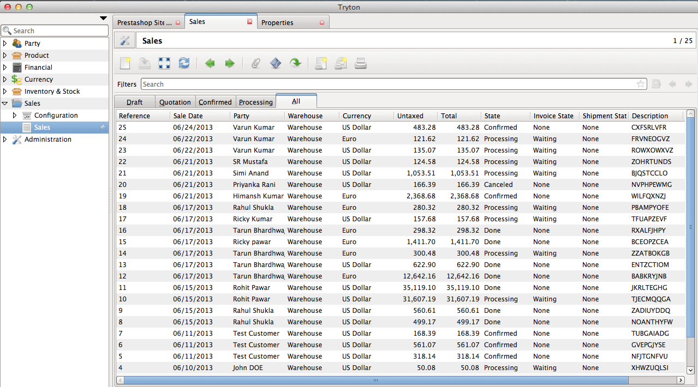

How it works
============

This section explains how the import and export of orders between Tryton
and Prestashop works.

.. note:: All the data represented below is demo data and is only for 
  demonstration purposes.

.. _import-orders:

Orders are imported as Sales
----------------------------

Orders placed in Prestashop are imported in Tryton. This is
periodically done by the Tryton CRON system. The default interval
between two imports is a day, but the interval
:ref:`can be modified <prestashop-crons>` to your requirements.

An order in prestashop has a number of entities related and they are
imported in tryton as described below:

* The Order is imported as a Sale. The sale in tryton can be identified by
  the reference which will be same as the order reference in prestashop.
  Internally the matching is done using the ID of the order as returned by
  prestashop.
  

* The Customer who placed the order is imported as Party. If the customer
  already exists in Tryton, then the same customer(party) is linked with the
  order.

* The invoice and shipping addresses specified by the customer while
  placing the order are imported as addresses, and assigned to the sale order's
  billing and shipment addresses. If these addresses exist in Tryton, then the
  same addresses are used else new address(es) for the Party is(are) created.

* The product lines, i.e., the products bought in the order by the
  customer are imported as Sale lines. The product in each of these lines is
  created as product in tryton, if it does not already exist.

* Discount on order is imported as a sale line in tryton with negative
  value.

* Shipping is imported as a sale line in tryton with the price as the
  shipping value on order in prestashop.

* Taxes are imported as taxes in tryton with the same details as on
  prestashop and then are linked to the tax lines on the product [TODO]

* The state of an order from prestashop to tryton is imported as:

  * If the order in prestashop is paid and shipped, it will be imported in
    tryton as a `done` order with all the processes already done.
    To achieve this, the order's invoicing method and shipping method are set to
    manual and no invoice or shipment is created.

  * If the order in prestashop is paid but not shipped, it will be
    imported in tryton as `processing` with invoicing being done but not
    shipped.

  * If the order in prestashop is neither paid nor shipped, it will be
    imported as `confirmed` with no invoice and no shipment.

.. note:: When the order import happens next time, the status of the
  orders in `processing` and `confirmed` state in tryton in tryton will be
  updated if there is a change in state on Prestashop. [TODO]

**Orders in Prestashop**

**Orders imported as Sales in Tryton**

| ``Menu: Sales > Sales``

**Order View in Prestashop**

**Sale in Tryton**

This import will also create/update parties and products corresponding to
customer and products in the order on prestashop.

**Customer in Prestashop**

**Party in Tryton**

**Product in Prestashop**

**Product in Tryton**

.. _export-orders:

Exporting Order Status from Tryton to Prestashop
------------------------------------------------

Once the order is processed in Tryton, the shipping status of the order
based on delivery and picking is updated on prestashop. This is
periodically done by the Tryton CRON system. The default interval
between two exports is a day, but :ref:`can be modified <prestashop-crons>`
to your requirements.

* The status of orders which are imported as `processing` in Tryton will be
  exported to Prestashop as `Delivered` once they are marked `shipped` and
  `done` in Tryton.

* The status of orders which are imported as `confirmed` in Tryton will be
  exported to prestashop as `Payment accepted` when they are invoiced and
  `paid` in tryton. These will be also be marked as `Delivered` if they
  are marked `shipped` in Tryton.

**Order processed in Tryton**

**Order Status exported to Prestashop**

